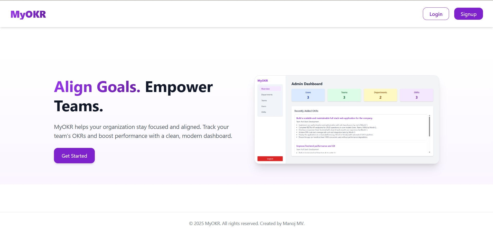
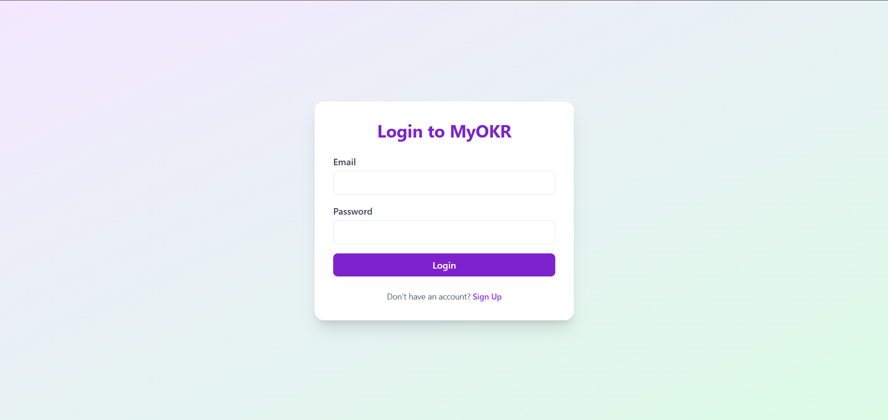
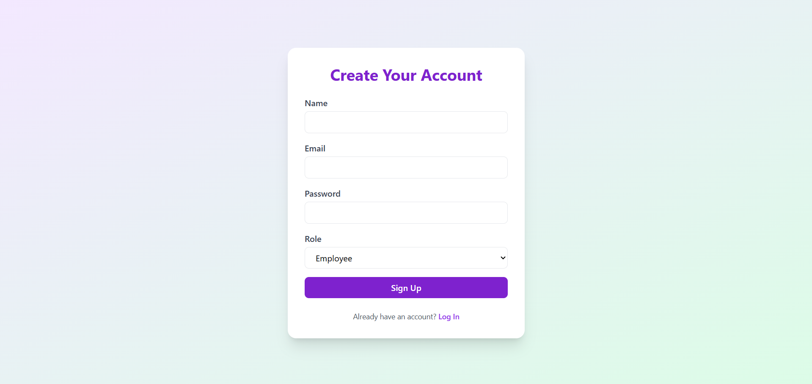
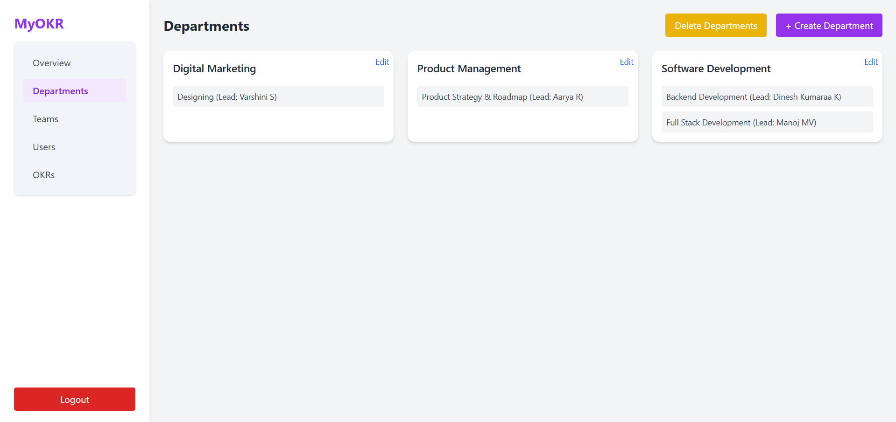
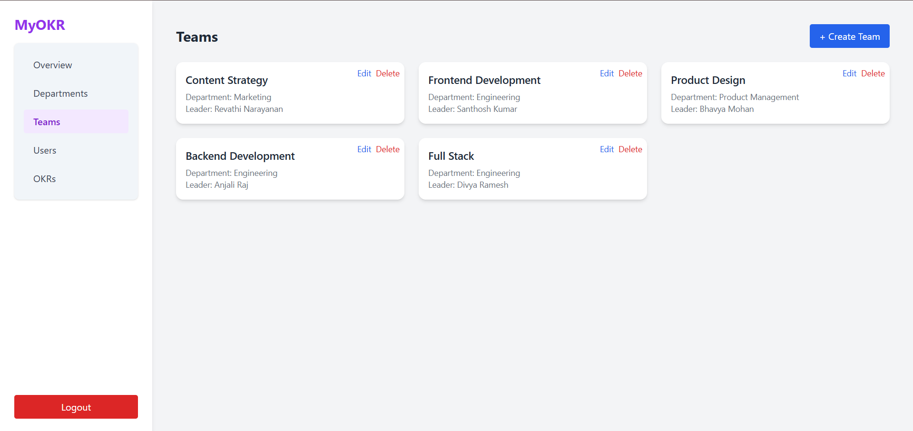
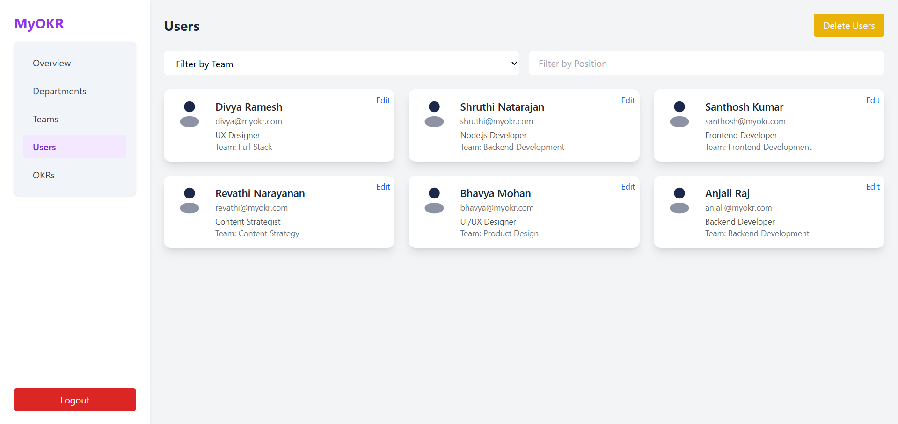
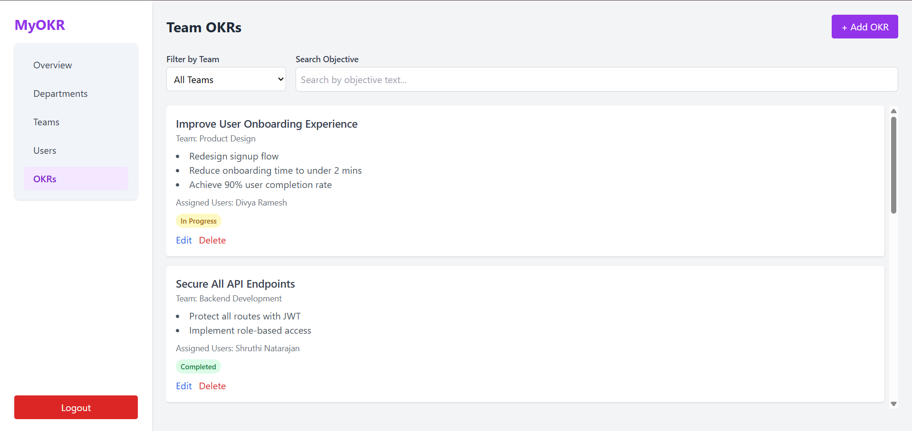
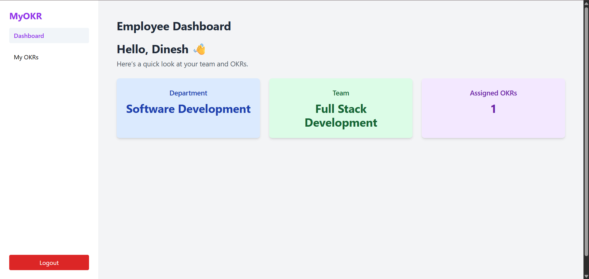
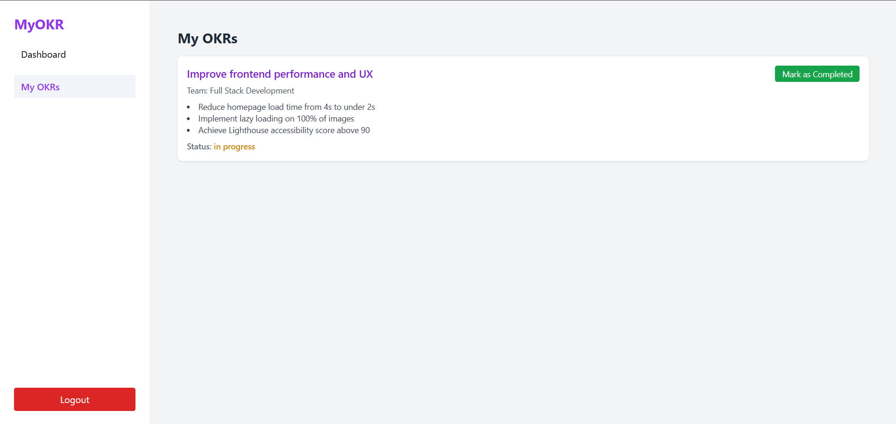

# MyOKR – OKR Management Platform

**MyOKR** is a full-stack Objective and Key Results (OKR) management platform developed as part of the **ABEX Full Stack Developer Internship Assessment**. The application allows organizations to define goals, assign them across teams and users, and monitor progress through a user-friendly interface.

---

## Features

### Authentication & Authorization
- Secure login and signup using JWT-based authentication
- Role-based access control for administrators and employees

### Organizational Hierarchy
- Structured hierarchy: Organization → Departments → Teams → Users
- Admins can manage departments, create teams, and assign users accordingly

### OKR Management
- Admin capabilities:
  - Create and assign OKRs to teams and individual users
  - Update and delete OKRs
- Employee capabilities:
  - View assigned OKRs
  - Track individual progress on key results

### Progress Tracking
- Visual indicators for tracking the progress of each key result
- Real-time updates on completion status

### Admin Dashboard
- Manage and monitor departments, teams, users, and OKRs
- Includes search, filtering, editing, and deletion functionalities
- Interactive UI with modals and feedback mechanisms

### Employee Dashboard
- Provides team and department details to the employee
- Displays all assigned OKRs in a structured layout

### Landing Page
- Introductory screen with project overview, preview image, and login/signup access

---

## Technology Stack

### Frontend
- React.js
- Tailwind CSS
- React Router DOM for client-side routing

### Backend
- Node.js with Express.js
- RESTful API design

### Database
- MongoDB Atlas
- Mongoose for modeling and schema management

### Authentication
- JSON Web Tokens (JWT) for secure session handling
- bcrypt for secure password hashing

---

## Application Screenshots

> Images are located in `/myokr-client/src/assets/`

### Landing Page  

### Login  

### Signup  

### Admin – Departments  

### Admin – Teams  

### Admin – Users  

### Admin – OKRs  

### Employee Dashboard  

### Employee OKRs  

---

## Security & Deployment Notes

- Environment variables and sensitive data are handled via `.env` files and excluded from version control using `.gitignore`
- MongoDB Atlas is used for remote database access during development
- All previously exposed secrets have been revoked and replaced with secure credentials

---

## Acknowledgment

This project was developed as part of the internship assessment for **ABEX Group**. I am grateful for the opportunity to work on a real-world full-stack application challenge that encompassed authentication, role-based dashboards, dynamic content management, and a polished user interface.

---

## Author

**Manoj MV**  
Email: [manojvelmurugan04@gmail.com](mailto:manojvelmurugan04@gmail.com)  
GitHub: [https://github.com/Manoj-velmurugan](https://github.com/Manoj-velmurugan)
