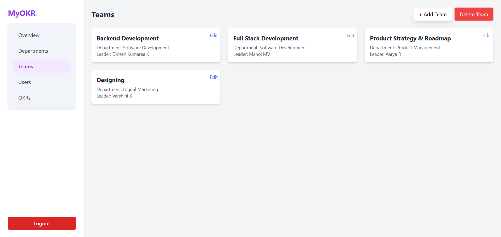
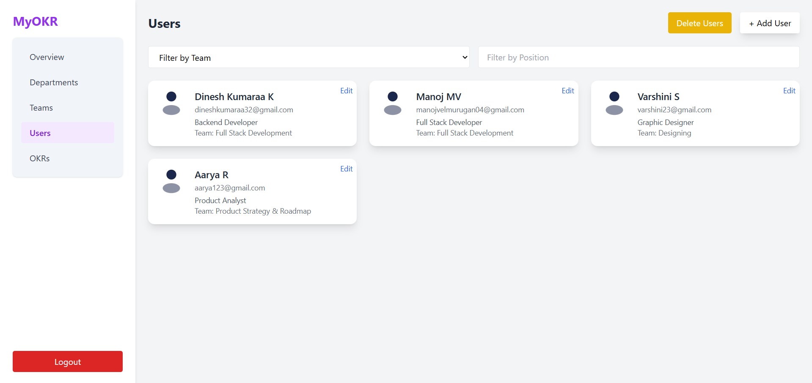
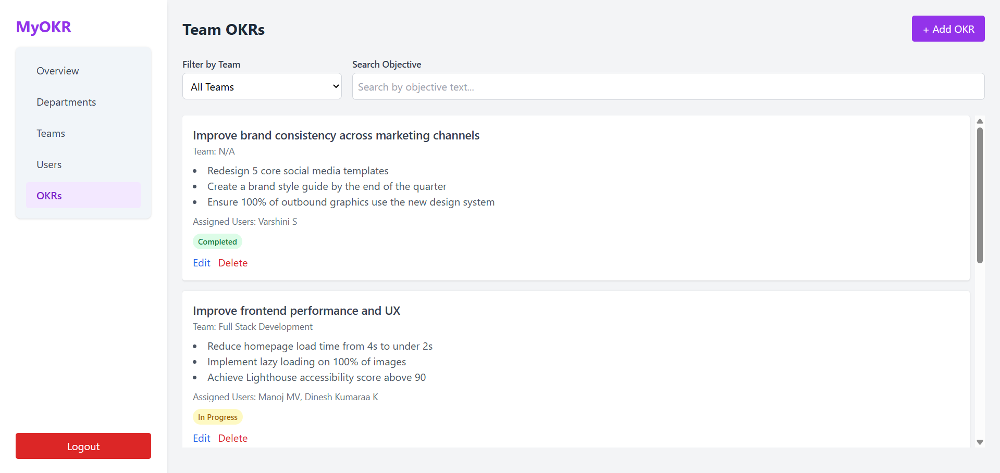

# MyOKR – OKR Management Platform

**MyOKR** is a full-stack Objective and Key Results (OKR) management platform. The application allows organizations to define goals, assign them across teams and users, and monitor progress through a user-friendly interface.

---

## Features

### Authentication & Authorization
- Secure login and signup using JWT-based authentication
- Role-based access control for administrators and employees

### Organizational Hierarchy
- Structured hierarchy: Organization → Departments → Teams → Users
- Admins can manage departments, create teams, and assign users accordingly

### OKR Management

#### Admin Capabilities:
- Create and assign OKRs to teams and individual users
- Update and delete OKRs

#### Employee Capabilities:
- View assigned OKRs
- Track individual progress on key results

### Progress Tracking
- Visual indicators for tracking the progress of each key result
- Real-time updates on completion status

### Admin Dashboard
- Manage and monitor departments, teams, users, and OKRs
- Includes search, filtering, editing, and deletion functionalities
- Interactive UI with modals and feedback mechanisms

### Employee Dashboard
- Provides team and department details to the employee
- Displays all assigned OKRs in a structured layout

### Landing Page
- Introductory screen with project overview, preview image, and login/signup access

---

## Technology Stack

### Frontend
- React.js
- Tailwind CSS
- React Router DOM for client-side routing

### Backend
- Node.js with Express.js
- RESTful API design

### Database
- MongoDB Atlas
- Mongoose for modeling and schema management

### Authentication
- JSON Web Tokens (JWT) for secure session handling
- bcrypt for secure password hashing

---

## How the App Works

### Admin Flow
1. Admin signs up or logs in.
2. Admin can view and manage:
   - **Departments**: Create/Edit/Delete departments
   - **Teams**: Create teams under departments and assign leaders
   - **Users**: All employees who signup are listed here
   - **OKRs**: Create OKRs and assign to teams or individual employees

### Employee Flow
1. Employee signs up or logs in.
2. Redirected to employee dashboard showing:
   - Their team and department details
   - List of OKRs assigned to them
   - Progress tracking for each key result

---

## Test Credentials

### Admin
- **Email:** `manoj@myokr.com`
- **Password:** `Test123!`

### Employees
- `divya@myokr.com` - `Test123!`  
- `santhosh@myokr.com` - `Test123!`  
- `anjali@myokr.com` - `Test123!`  
- `revathi@myokr.com` - `Test123!`  
- `bhavya@myokr.com` - `Test123!`  
- `shruthi@myokr.com` - `Test123!`

###
You can access the live version of **MyOKR** here:  
🔗 [https://myokr-two.vercel.app/](https://myokr-two.vercel.app/)

---

## 📷 Application Screenshots

> Images are located in `/myokr-client/src/assets/`

- **Landing Page**  
  

- **Login**  
  

- **Signup**  
  

- **Admin – Departments**  
  

- **Admin – Teams**  
  

- **Admin – Users**  
  

- **Admin – OKRs**  
  

- **Employee Dashboard**  
  

- **Employee OKRs**  
  

---

## 🛡️ Security & Deployment Notes

- Environment variables and sensitive data are handled via `.env` files and excluded from version control using `.gitignore`
- MongoDB Atlas is used for remote database access during development
- All previously exposed secrets have been revoked and replaced with secure credentials

---

## 👨‍💻 Author

**Manoj MV**  
📧 Email: [manojvelmurugan04@gmail.com](mailto:manojvelmurugan04@gmail.com)  
🔗 GitHub: [https://github.com/Manoj-velmurugan](https://github.com/Manoj-velmurugan)
